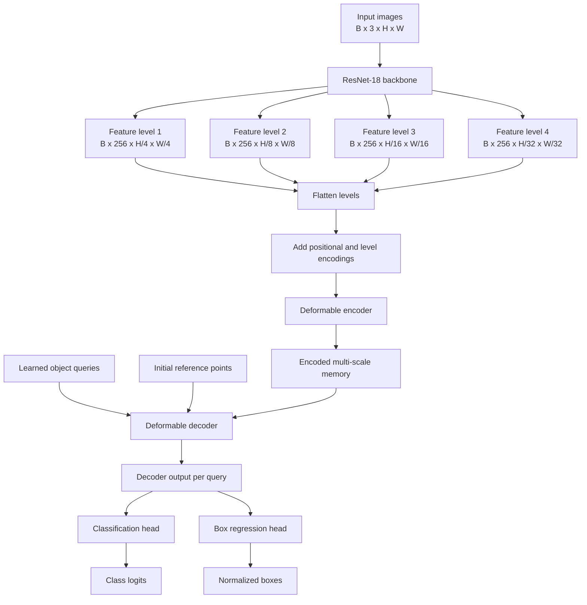
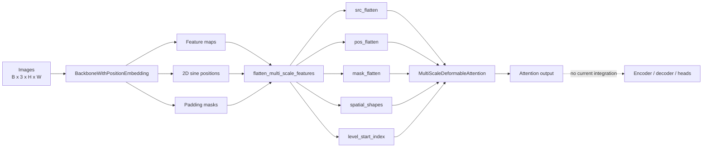
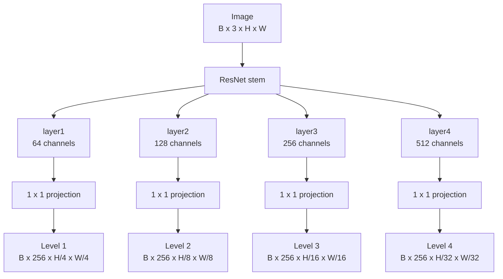
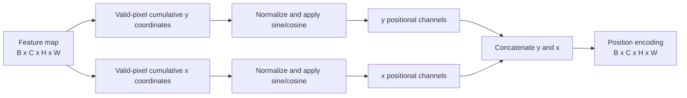
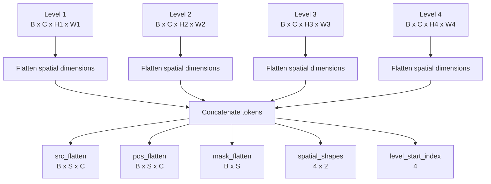
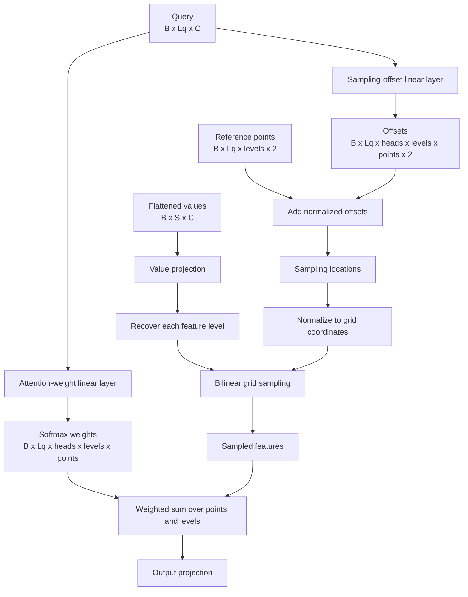
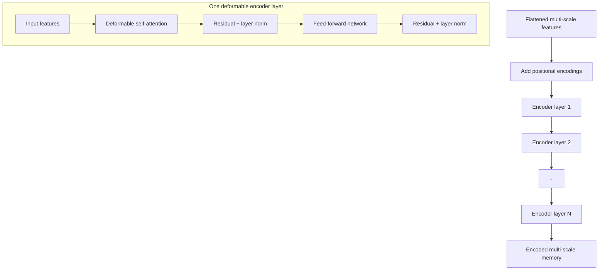
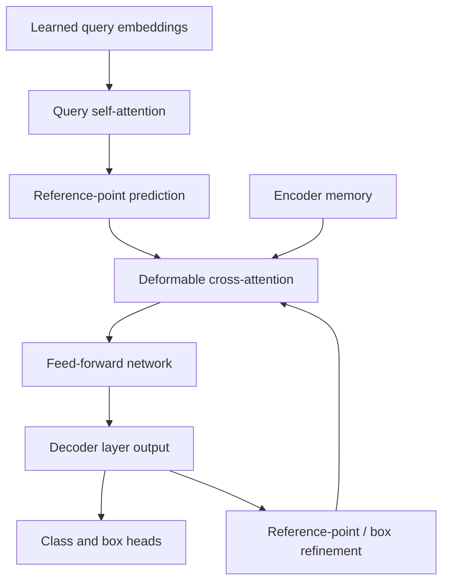
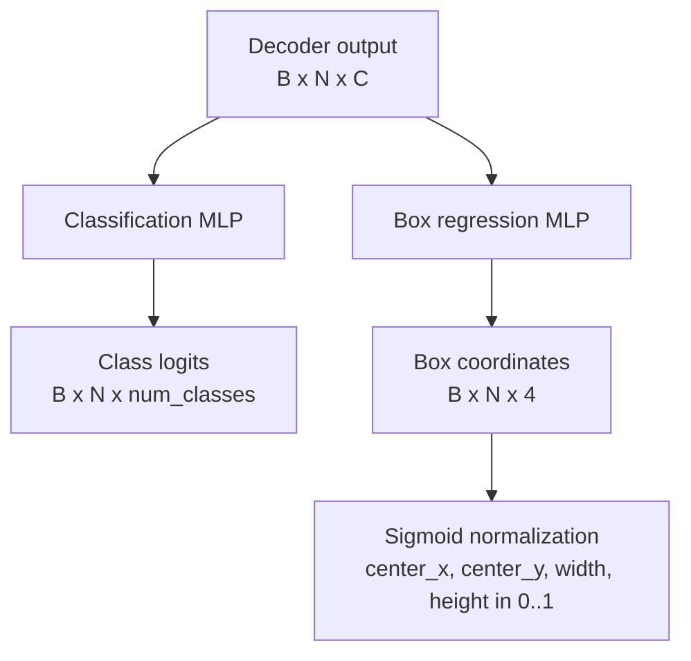

# Deformable DETR Architecture

This document explains the Deformable DETR architecture represented by this folder. It separates the components that currently exist in the repository from the components still needed for a complete end-to-end detector.

## Status At A Glance

```text
Implemented                                              Missing for a complete model
-----------                                              ----------------------------
ResNet-18 backbone                                      Deformable encoder stack
Multi-scale feature projections                         Deformable decoder stack
2D sine positional encodings                            Object queries
Feature flattening and level metadata                  Reference-point generation
Multi-scale deformable attention primitive              Iterative box refinement
                                                         Classification head
                                                         Bounding-box head
                                                         Top-level model forward
```

The current code provides reusable architectural primitives. There is not yet a single `DeformableDETR` module that maps images to class logits and bounding boxes.

## Complete Target Architecture

The intended high-level pipeline is:



## Current Repository Data Flow

The implemented path currently ends after producing the flattened multi-scale representation and providing an attention primitive that can consume it.



## 1. Backbone

**File:** `backbone.py`

**Main class:** `BackboneWithPositionEmbedding`

The backbone uses ResNet-18 intermediate stages rather than only the final feature map. Each stage is projected to the common transformer dimension, which is `256` by default.



For a `320 x 320` input, the current tests expect:

| Level | ResNet stage | Projected feature shape |
| --- | --- | --- |
| 1 | `layer1` | `B x 256 x 80 x 80` |
| 2 | `layer2` | `B x 256 x 40 x 40` |
| 3 | `layer3` | `B x 256 x 20 x 20` |
| 4 | `layer4` | `B x 256 x 10 x 10` |

The backbone returns three parallel lists:

```python
features, positional_encodings, masks = backbone(images)
```

Each list contains one item per feature level.

### Padding masks

A boolean mask has shape `[B, H, W]`, where `True` means padded. The mask is resized to each feature level with nearest-neighbor interpolation. This allows later attention layers to ignore padded source locations.

## 2. 2D Sine Positional Encoding

**File:** `position_embedding.py`

**Main class:** `PositionEmbeddingSine`

Convolutional feature maps have an implicit spatial layout, but transformer attention itself does not know the meaning of token order. The positional encoding supplies normalized x/y coordinates using sine and cosine functions.



The positional encoding has the same channel count as the projected feature map. At each spatial level, the intended transformer input is conceptually:

```text
encoded_feature_level = feature_level + positional_encoding_level
```

The repository currently computes and returns both tensors, but no encoder or top-level model currently performs this addition.

## 3. Flattening Multi-scale Features

**File:** `feature_utils.py`

**Main function:** `flatten_multi_scale_features`

Each `[B, C, H_i, W_i]` level is converted into `[B, H_i W_i, C]`. The levels are then concatenated along the token dimension.



Here:

```text
S = H1*W1 + H2*W2 + H3*W3 + H4*W4
```

For the four levels from a `320 x 320` image:

```text
S = 80*80 + 40*40 + 20*20 + 10*10
  = 6400 + 1600 + 400 + 100
  = 8500 tokens
```

`spatial_shapes` and `level_start_index` let deformable attention recover each level from the concatenated sequence:

```text
spatial_shapes     = [[H1, W1], [H2, W2], [H3, W3], [H4, W4]]
level_start_index = [0, H1*W1, H1*W1 + H2*W2, ...]
```

## 4. Multi-scale Deformable Attention

**File:** `multi_scale_deformable_attention.py`

**Main class:** `MultiScaleDeformableAttention`

This module is the central sparse-attention primitive. Instead of comparing a query with every token in every feature map, it predicts a small set of offsets around reference points and samples only those locations.

### Inputs and outputs

```text
query:              [B, Lq, C]
input_flatten:      [B, S, C]
reference_points:   [B, Lq, levels, 2]
spatial_shapes:     [levels, 2]
level_start_index:  [levels]
input_padding_mask: [B, S]

output:             [B, Lq, C]
```

### Internal computation



For level $l$, query $q$, and point $k$, the sampling location is conceptually:

$$
p_{qlk} = r_{ql} + \frac{\Delta p_{qlk}}{(W_l, H_l)}
$$

where:

- $r_{ql}$ is the reference point
- $\Delta p_{qlk}$ is the predicted offset
- $(W_l, H_l)$ converts pixel-scale offsets into normalized x/y coordinates

The implementation uses `torch.nn.functional.grid_sample` with bilinear interpolation and zero padding outside the feature map.

### What this module does not provide

This module is an attention operation, not a full transformer layer. It does not itself provide:

- residual connections
- layer normalization
- a feed-forward network
- query self-attention
- reference-point generation
- encoder or decoder stacking
- iterative box refinement

## 5. Missing Deformable Encoder

A complete Deformable DETR encoder should wrap deformable self-attention in repeated transformer layers.



The encoder also needs reference points for each source token. In the original Deformable DETR design, these are generated from token coordinates and adjusted using valid ratios so padded image regions do not distort the geometry.

Current status: **not implemented**.

## 6. Missing Deformable Decoder

The decoder transforms a fixed set of learned object queries into object-specific representations.



A decoder layer normally contains:

1. self-attention among object queries
2. deformable cross-attention from queries into encoder memory
3. a feed-forward network
4. residual connections and layer normalization
5. optional iterative refinement of the reference point or predicted box

Current status: **not implemented**.

## 7. Missing Object Queries and Reference Points

Deformable DETR uses a fixed number of query slots, for example `N = 300`. Each query can represent one possible object.


The current attention primitive requires `reference_points` as an input, but no module currently creates those points or associates them with decoder queries.

For the full model, the decoder should also support the box-aware form of reference points used for refinement:

```text
2D reference point: [x, y]
4D reference box:    [x, y, width, height]
```

Current status: **not implemented**.

## 8. Missing Detection Heads

The decoder output for each query must be converted into predictions.



The class head normally predicts one logit per category plus a no-object category. The box head normally predicts normalized center-based boxes:

```text
[x_center, y_center, width, height]
```

Current status: **not implemented**.

## 9. Expected End-to-end Tensor Flow

A future top-level model could expose a flow similar to this:

```text
images
  [B, 3, H, W]
    |
    v
backbone
  features: [B, C, H1, W1], ... [B, C, H4, W4]
  positions: same shapes
  masks: [B, H1, W1], ... [B, H4, W4]
    |
    v
flatten + add positions + add level embeddings
  src: [B, S, C]
  mask: [B, S]
  spatial_shapes: [4, 2]
  level_start_index: [4]
    |
    v
encoder
  memory: [B, S, C]
    |
    +-----------------------------+
    |                             |
    v                             v
learned queries              initial references
  [B, N, C]                   [B, N, 2]
    \                             /
     v                           v
        decoder stack
          [B, N, C]
              |
              +-------------------+
              |                   |
              v                   v
       class head             box head
       [B, N, K]              [B, N, 4]
```

## 10. Current Test Coverage

The DETR tests currently validate the implemented primitives:

| Area | Covered |
| --- | --- |
| Backbone output levels and shapes | Yes |
| Positional encoding shape and finiteness | Yes |
| Feature flattening and level metadata | Yes |
| Deformable attention output shape | Yes |
| Deformable attention finite values | Yes |
| Basic input validation | Yes |
| End-to-end image-to-detection model | No model exists yet |
| Encoder behavior | No encoder exists yet |
| Decoder behavior | No decoder exists yet |
| Query/reference-point behavior | No implementation yet |
| Class and box predictions | No heads exist yet |
| Iterative refinement | No implementation yet |

The current component test suite passes with the existing implementation.

## Summary

The folder currently contains the front half of the architecture and the core sparse sampling operation:

```text
ResNet multi-scale features
  + 2D positions
  + flattening metadata
  + deformable attention primitive
```

To become a complete Deformable DETR model, it still needs:

```text
encoder layers
  + decoder layers
  + learned queries
  + reference-point generation
  + class head
  + box head
  + iterative refinement
  + top-level model integration
```
