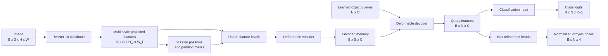
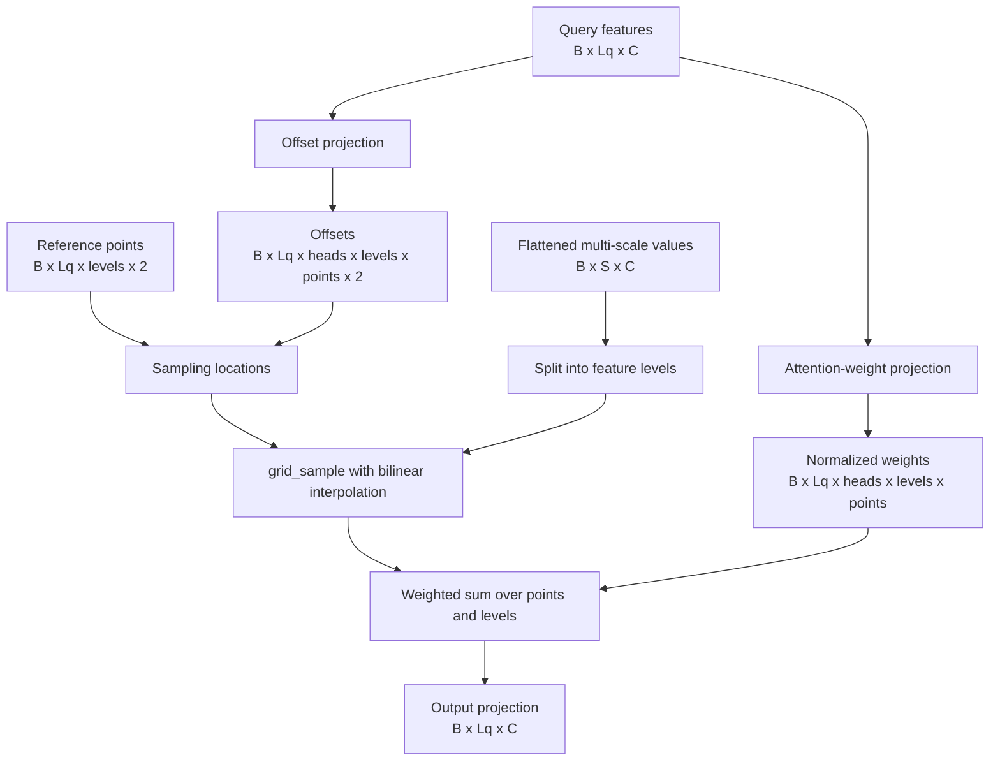
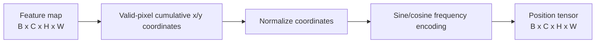
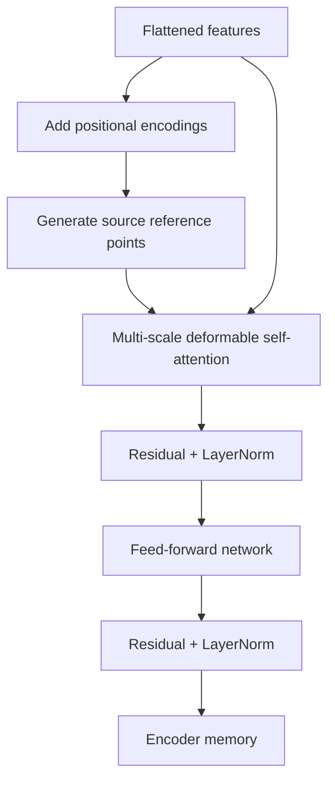
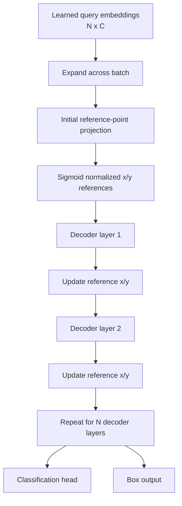
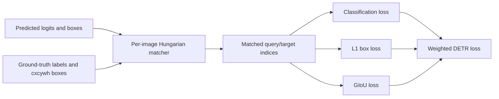

# Deformable DETR

A modular PyTorch implementation of **Deformable DETR: Deformable Transformers for End-to-End Object Detection**.

> Zhu et al., 2020. [Read the paper on arXiv](https://arxiv.org/abs/2010.04159)

Deformable DETR combines a convolutional backbone with a transformer encoder-decoder detector. Its defining operation is **multi-scale deformable attention**: instead of attending densely to every spatial token, each query predicts a small set of sampling offsets and attention weights around reference points across several feature-map resolutions.

This design preserves the global reasoning of transformers while making high-resolution, multi-scale vision features substantially more practical.

## Model At A Glance



The top-level module is `DeformableDetr`. Its forward pass returns:

```python
decoder_output, encoder_memory = model(images, masks)
queries, boxes, class_logits = decoder_output
```

where `boxes` are normalized `(center_x, center_y, width, height)` values and the final classification channel represents the no-object class.

## Why Deformable Attention?

Vanilla DETR applies dense attention over all image tokens. High-resolution feature maps create a large token sequence, making that operation expensive and slowing optimization.

Deformable attention makes the interaction sparse and spatially informed:

1. A query predicts offsets for each attention head, feature level, and sampling point.
2. The offsets are added to a reference point.
3. The resulting normalized coordinates are sampled with bilinear interpolation.
4. Learned attention weights combine the sampled features.
5. The per-head results are merged and projected back to the model dimension.



For feature level $l$, query $q$, and sampling point $k$, the implementation uses the following normalized location:

$$
p_{qlk} = r_{ql} + \frac{\Delta p_{qlk}}{(W_l, H_l)}
$$

Here, $r_{ql}$ is the reference point, $\Delta p_{qlk}$ is the predicted offset, and $(W_l, H_l)$ converts feature-pixel offsets into normalized `(x, y)` coordinates.

## Backbone And Feature Pyramid

`BackboneWithPositionEmbedding` uses the first four intermediate stages of ResNet-18:

| Feature level | Source stage | Channels before projection | Resolution for 320 x 320 input |
| --- | --- | ---: | ---: |
| 1 | `layer1` | 64 | 80 x 80 |
| 2 | `layer2` | 128 | 40 x 40 |
| 3 | `layer3` | 256 | 20 x 20 |
| 4 | `layer4` | 512 | 10 x 10 |

Each stage is mapped to the shared transformer dimension with a 1 x 1 convolution. With the default `hidden_dim=256`, the resulting levels are:

```text
[B, 256, 80, 80]
[B, 256, 40, 40]
[B, 256, 20, 20]
[B, 256, 10, 10]
```

The backbone also creates a boolean padding mask for each level. `True` denotes padded image locations, allowing attention to zero out invalid source values.

## 2D Positional Encoding

`PositionEmbeddingSine` supplies spatial information that transformer tokens do not retain by themselves. It builds cumulative x and y coordinates over valid pixels, optionally normalizes them, and encodes them with sine and cosine functions.



The encoder uses the positional tensor to form its query representation:

```text
query = flattened_features + flattened_positions
values = flattened_features
```

Keeping these roles separate lets the positional information guide sampling while the value path remains the image feature representation.

## Flattened Multi-scale Representation

`flatten_multi_scale_features` converts every feature level from `[B, C, H_i, W_i]` to `[B, H_i W_i, C]` and concatenates the levels into one sequence.

For four levels:

```text
S = H1*W1 + H2*W2 + H3*W3 + H4*W4
```

At 320 x 320, this is:

```text
S = 80*80 + 40*40 + 20*20 + 10*10 = 8,500 tokens
```

The flattening step returns the metadata needed to recover the original feature maps:

| Tensor | Shape | Purpose |
| --- | --- | --- |
| `src_flatten` | `[B, S, C]` | Concatenated feature values |
| `pos_flatten` | `[B, S, C]` | Concatenated positional encodings |
| `mask_flatten` | `[B, S]` | Concatenated padding mask |
| `spatial_shapes` | `[levels, 2]` | Each level's `[H, W]` |
| `level_start_index` | `[levels]` | Start offset of each level in the sequence |

## Deformable Encoder

The encoder is implemented by `DeformableTransformerEncoder` and repeated `DeformableTransformerEncoderLayer` modules.

Each layer performs:

1. Generate a normalized reference point at the center of every source token.
2. Add positional encodings to the source features to form attention queries.
3. Apply multi-scale deformable self-attention.
4. Add a residual connection and layer normalization.
5. Apply a two-layer feed-forward network.
6. Add a second residual connection and layer normalization.



The encoder memory has shape `[B, S, C]` and is shared by all decoder queries.

## Deformable Decoder

The decoder is implemented by `DeformableTransformerDecoder`. It starts with a fixed set of learned object-query embeddings, shared across images in a batch.

Each decoder layer contains:

1. Standard multi-head self-attention among object queries.
2. Multi-scale deformable cross-attention into encoder memory.
3. A feed-forward network.
4. Residual connections and layer normalization.
5. A box-refinement projection.



### Reference points and box refinement

The decoder predicts initial two-dimensional reference points from the learned queries. After each decoder layer, a linear box-refinement head predicts four offsets:

```text
delta_x, delta_y, delta_width, delta_height
```

The x/y offsets update the reference points through inverse-sigmoid refinement. The final normalized box is assembled as:

```text
[refined_center_x, refined_center_y, sigmoid(delta_width), sigmoid(delta_height)]
```

The current implementation uses the first feature-level copy of the refined reference points to produce the final box output. The result is normalized `cxcywh`, not pixel-space `xyxy`.

## Detection Outputs

The decoder classification head produces one logit for every foreground class plus one no-object class:

```text
class_logits: [B, num_queries, num_classes + 1]
boxes:        [B, num_queries, 4]
```

During inference or visualization, foreground probabilities can be selected with:

```python
probabilities = class_logits.softmax(dim=-1)
scores, labels = probabilities[..., :-1].max(dim=-1)
```

The final channel is excluded from this selection because it represents background/no-object. Box conversion to pixel-space `xyxy` is only needed for visualization or geometry utilities:

```python
xyxy = cxcywh_to_xyxy(boxes)
xyxy = xyxy * torch.tensor([W, H, W, H])
```

## Training Objective

The training-side components in this module are `Matcher` and `DETRLoss`.

For each image, the matcher builds a pairwise cost matrix between queries and ground-truth objects:

$$
C = \lambda_{cls} C_{cls} + \lambda_{L1} C_{L1} + \lambda_{GIoU} C_{GIoU}
$$

The Hungarian algorithm selects a one-to-one assignment that minimizes this cost. Matching is performed independently per image because each image contains a different number of target objects.

The loss then combines:

- cross-entropy classification over all queries, assigning unmatched queries to no-object
- L1 regression loss for matched normalized `cxcywh` boxes
- GIoU loss for matched boxes after conversion to `xyxy`

Ground-truth boxes enter the matcher and loss in pixel-space `cxcywh`. They are normalized internally using the transformed image width and height. Conversion to `xyxy` is used only for GIoU computation.



## Implementation Map

| Component | Module | Role |
| --- | --- | --- |
| Backbone and masks | `backbone.py` | Multi-scale ResNet-18 features |
| Positional encoding | `position_embedding.py` | 2D sine/cosine spatial features |
| Sequence metadata | `feature_utils.py` | Flatten levels and track boundaries |
| Sparse attention | `multi_scale_deformable_attention.py` | Offset-based bilinear sampling |
| Encoder | `deformable_transformer_encoder.py` | Deformable source self-attention stack |
| Decoder | `deformable_transformer_decoder.py` | Query attention and box refinement |
| Model assembly | `deformable_detr.py` | End-to-end image-to-prediction path |
| Assignment | `matcher.py` | Per-image Hungarian matching |
| Training loss | `detr_loss.py` | Classification, L1, and GIoU losses |

## References

- Zhu, X. et al. [Deformable DETR: Deformable Transformers for End-to-End Object Detection](https://arxiv.org/abs/2010.04159).
- Carion, N. et al. [End-to-End Object Detection with Transformers](https://arxiv.org/abs/2005.12872).
